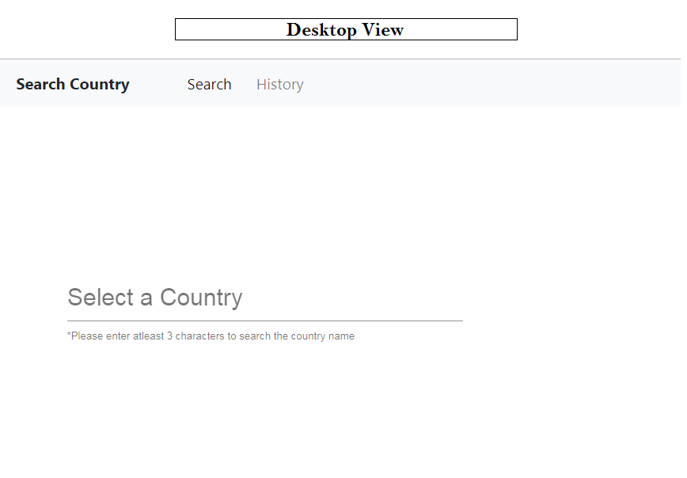
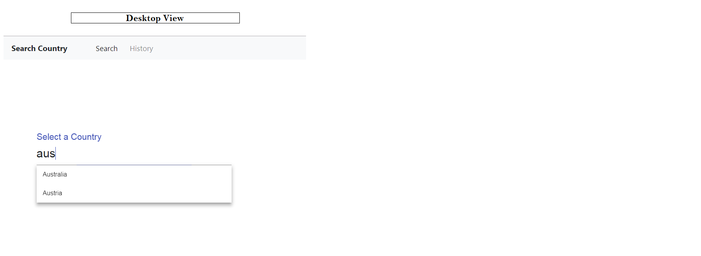
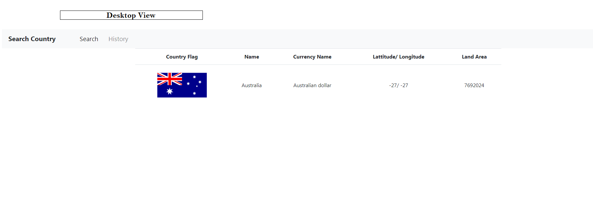
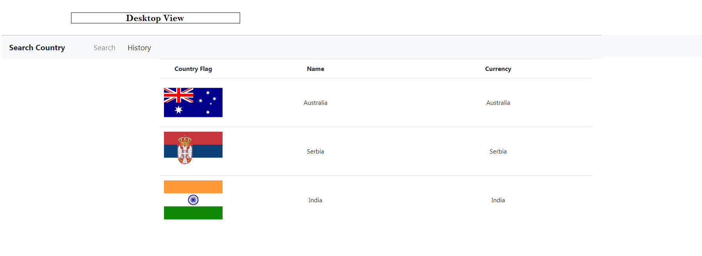

# Realtime Country Details App

This project was generated with [Angular CLI](https://github.com/angular/angular-cli) version 1.7.4.

## How to use
One can utilize this app to find the country details and generate (& store) the history of the latest searches in the browser storage

## API used
http://countryapi.gear.host/v1/Country/getCountries

This API provides real time data about a country. Following Information is available for a country 
- a. Country flag
- b. Currency
-c. Capital
-d Area
-e. Latitude and Longitude

and several other geographical details

## Live app

Live app can be accessed at 

`https://deepeshdesigns.github.io/flare/`

## FrontEnd Snapshots

## Development server

Run `ng serve` for a dev server. Navigate to `http://localhost:4200/`. The app will automatically reload if you change any of the source files.

## Code scaffolding

Run `ng generate component component-name` to generate a new component. You can also use `ng generate directive|pipe|service|class|guard|interface|enum|module`.

## Build

Run `ng build` to build the project. The build artifacts will be stored in the `dist/` directory. Use the `-prod` flag for a production build.

## Running unit tests

Run `ng test` to execute the unit tests via [Karma](https://karma-runner.github.io).

## Running end-to-end tests

Run `ng e2e` to execute the end-to-end tests via [Protractor](http://www.protractortest.org/).

## Further help

To get more help on the Angular CLI use `ng help` or go check out the [Angular CLI README](https://github.com/angular/angular-cli/blob/master/README.md).
